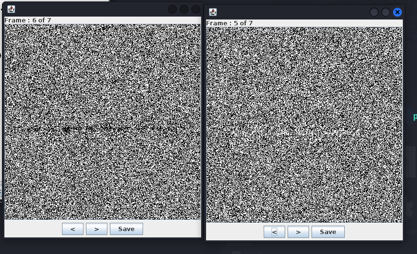
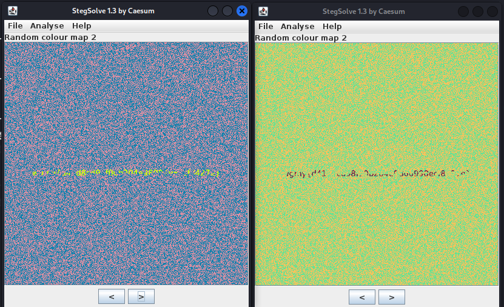
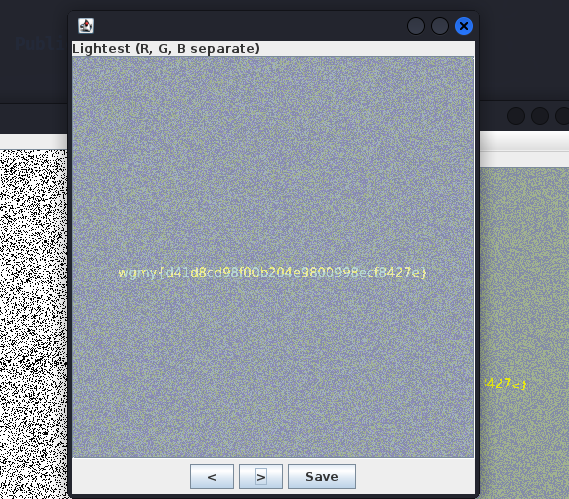

#### Task description
The flag is hidden somewhere in this GIF. You can't see it? Must be written in transparent ink.

#### Solve
We are given `challenge.gif` file. There is nothing on the gif, so opening stegsolve again, and we can see there two strange frames:

Be looking at this in random colour map mode we can see those two frames are parts of flag:

We should save those files and combine them, and as a result we will get the flag:

