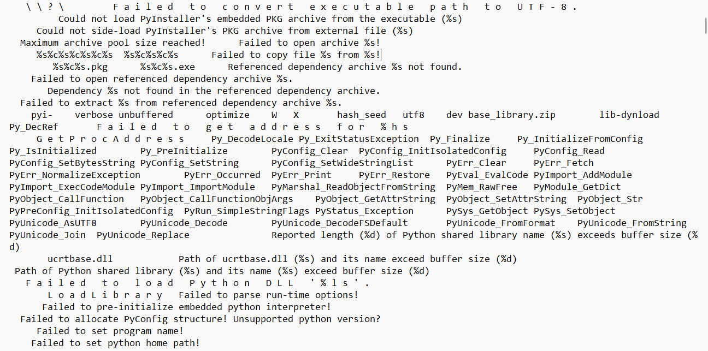
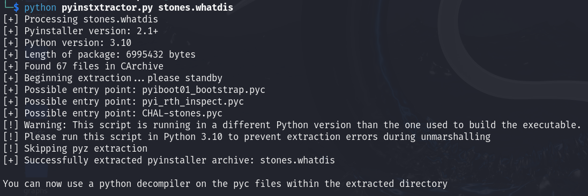
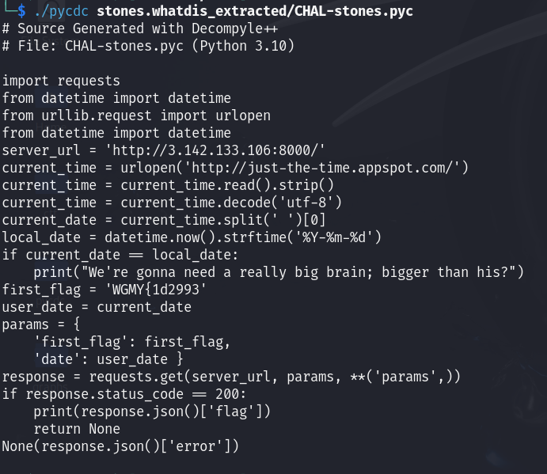

#### Task description
When Thanos snapped his fingers, half of the flag was blipped. We need the Avengers to retrieve the other half.

There's no flag in the movie, but there is a slash flag on the server

#### Solve
We are given `stones.whatdis` file. Lets look at this:

And by this we can recognize python executable file, so we should decompyle it. To do that we will use pyinstxtractor.py and pycdc.

We have got url and parameters for get request, so we can try it by `curl http://3.142.133.106:8000/?first_flag=WGMY{1d2993&date=2024-12-27`, but the response is gonna be {error: "Wrong date"}, That means that we should find the correct date. According to task description, there is slash flag on the server, so lets try it with `curl http://3.142.133.106:8000/flag`, and we will get `{"Upload Date":"https://youtu.be/V0zJb2K4Yi8?si=xUTuXD3ppkJpU2Nw&t=75"}`. So ypu should try for the first request date of the uploading of that youtube video (`curl http://3.142.133.106:8000/?first_flag=WGMY{1d2993&date=2022-07-25`) and you will get the flag.
